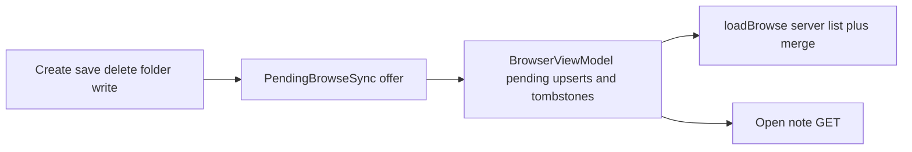

# Vaultist architecture

## Boundaries

The Markdown Vault filesystem is authoritative. Only the Go server accesses it. Android sees domain models from `VaultRepository`; HTTP DTO parsing, URL construction, and settings persistence remain below that interface. Compose screens contain presentation and interaction logic but no filesystem or network operations.

The server is split into restrained packages:

- `internal/vault` validates normalized vault-relative paths and confines file opens to the configured root.
- `internal/markdown` uses Goldmark's syntax tree for standard Markdown structure and a stateful scanner for Markdown Vault wiki links. The scanner explicitly excludes fenced and inline code. See [markdown-dialect.md](markdown-dialect.md) for the full dialect.
- `internal/index` owns refresh lifecycle, immutable snapshots, deterministic resolution, backlinks, revisions, and lazy file opens.
- `internal/search` matches notes by filename/title/alias (`files`) or note body text (`content`) against precomputed search blobs on the published snapshot.
- `internal/api` maps domain results to the versioned HTTP contract and structured safe errors.
- `internal/config` reads process configuration without hard-coding Linux host paths.

## Index and resolution

Each refresh walks non-hidden regular files once. Markdown bodies are bounded, hashed, parsed, and then released. Indexed note metadata includes stable ID, relative path, title, aliases, headings, link occurrences, attachments, modification data, size, revision, and a safe parse/read error. Image assets have path/name lookup tables and streaming metadata.

A replacement snapshot is assembled completely before an atomic publication. Requests keep using the last good snapshot during a refresh or temporary filesystem failure. The process health endpoint does not require a ready index. Refresh work checks context cancellation while walking and between notes.

Note resolution tries exact case-sensitive paths, unique case-insensitive paths, relative standard-Markdown paths, bare filenames, and frontmatter aliases. Candidate sets are sorted and deduplicated. More than one candidate is an explicit ambiguous result. Incoming backlinks are derived from every resolved outgoing note-link occurrence, retaining repeated references and source positions.

Asset resolution tries the current note directory, Markdown Vault root, configured attachment folder, and bare filename lookup. It never rescans during a request. Only PNG, JPEG, WebP, GIF, and SVG are indexed for serving in this release.

## Stale index, writes, and client sync

Vault writes (create, save, delete, external edits) land on disk **before** the published snapshot catches up. Full reindex is asynchronous. Clients must not assume browse/search/note GET all reflect the same generation immediately after a write.

### Server invariants

| Concern | Rule | Owner |
|---------|------|--------|
| Refresh scheduling | `StartRefresh` **coalesces** when a refresh is already running (`pendingRefresh` → follow-up reindex after the current one finishes). Never drop a write-triggered refresh. | `internal/index/manager.go` |
| Note GET body + revision | `GET /notes/{id}` serves bytes from disk; `revision` and ETag are `sha256:` of those bytes (not snapshot metadata alone). | `internal/index/read.go`, `internal/api/notes_read.go` |
| Unindexed note GET | If the `.md` file exists but the note is not in the snapshot yet, GET still succeeds via `GetNoteForRead` (same on-disk seam as create/write). | `internal/index/read.go` |
| Note PUT | `If-Match` compares **on-disk** hash at write time, not snapshot alone. Resolve path via snapshot or on-disk file. | `internal/index/write.go` |
| Browse / search lists | Folder browse and search use the **snapshot only** until the next completed refresh. | `internal/api/browse.go`, `internal/search` |

Concurrent create-then-save often starts two refreshes; coalescing ensures the index eventually includes the latest disk state.

### Android: mutation-aware browse cache

Browse is not a passive mirror of `GET /notes`. After writes, the client keeps a **durable pending layer** until the server list catches up.

| Step | Rule | Owner |
|------|------|--------|
| Emit mutations | Every write path offers `BrowseMutation` (`UpsertNote`, `UpsertFolder`, `DeleteNote`) via `PendingBrowseSync`. | `CreateNoteViewModel`, `NoteViewModel`, callers |
| Merge on load | `loadBrowse` filters delete tombstones, then **merges** pending upserts for the current folder. Never replace the list from the server alone after a write. | `BrowserViewModel` |
| Return to browse | `onReturnedToBrowse` drains pending mutations and applies them. **Reconcile** (poll index + reload browse) only when there were **deletes** — not upsert-only returns. | `BrowserViewModel` |
| Create → editor | `NoteOpenSeed` seeds the editor from the create `201` body; `includeCreatedNote` adds a pending upsert. Do not reconcile browse when navigating into the new note. | `BrowserScreen`, `CreateNoteViewModel` |
| Note reload | Silent reload after save/resume must not downgrade `revision` when content is unchanged (`mergeLoadedNote`). | `NoteViewModel` |
| Widget | Refresh bound widgets when note content or revision changes on load/save/delete (app-driven; no periodic polling). | `NoteViewModel`, `NoteWidgetRefresh` |

Manual browse refresh clears pending mutations once the server list is authoritative again.

### Anti-patterns (regressions to avoid)

- Showing a note in browse from a pending upsert while `GET /notes/{id}` requires a snapshot entry → “Note was not found” when opening.
- Optimistic browse insert **without** durable pending merge → note disappears after `loadBrowse` against a stale snapshot.
- Calling `reconcileAfterMutation` on every return from the note screen → unnecessary list clear/spinner; can wipe optimistic rows before merge runs.
- Ignoring `ErrRefreshActive` on the server without coalescing → index stays stale after create-then-save.

### Out of scope here

- Search and Ask hit lists remain snapshot-only until refresh completes (pending upserts do not inject into search results).
- No widget periodic network polling in v1.
- No incremental single-note reindex (full `StartRefresh` only).

See [Editing](#editing) for HTTP endpoints and UI entry points.

## Search

Search runs against the current immutable snapshot only; results reflect the last completed index generation until the next refresh.

At index build time each successfully indexed note gets precomputed lowercase search blobs: **files** (filename, title, aliases) and **content** (full note body). Queries are case-insensitive substring matches over those blobs in vault path order (`OrderedNoteIDs`). Search does not re-read note files from disk. Notes with index errors or oversized bodies are omitted from search blobs. Memory use scales with indexed note body size (bounded by the index read limit per note).

The stable Go interface is `internal/search.Search(ctx, snapshot, Request{Query, Mode})`. HTTP pagination (`limit`/`cursor`) and JSON mapping stay in `internal/api`. Server-side ranking and snippets are not exposed in HTTP v1.

## HTTP and caching

All routes live below `/api/v1`. Lists/searches have bounded limits and stable numeric cursors. Note GET responses return quoted content-revision ETags and `revision` computed from the on-disk bytes served in the body (so conditional GET and edit `If-Match` stay aligned even when the index snapshot lags). Indexed notes use snapshot metadata for title and link resolutions; notes on disk before the index catches up are readable via GET once the `.md` file exists (same on-disk seam as create/write). Assets use weak metadata ETags and `http.ServeContent`, which supplies streaming and byte ranges. Responses are private-cache scoped.

Stable note IDs are normalized relative Markdown paths without `.md`; asset IDs are normalized relative paths. IDs may contain slash segments, Unicode, and spaces. They are URL encoded by Android and validated again by the server.

Search accepts `mode=files` (indexed filenames, titles, aliases) and `mode=content` (note body text against the current snapshot). The HTTP contract does not define an Ask mode. On Android, `SearchMode.Ask` is UI-only: Ask retrieval calls `/search` with `files` and `content` explicitly inside `VaultAskEngine`; `VaultistApi` must never send `mode=ask`.

Contract enforcement: OpenAPI is authoritative; server responses are validated against schemas in `internal/api/schema_test.go`; Android maps JSON in `ApiDtos.kt` with coverage in `ApiDtosTest.kt`. See [CONTRIBUTING.md](CONTRIBUTING.md).

Structured logs go to stdout as JSON (`log/slog`). Each request logs `method`, classified `route` (e.g. `/api/v1/notes/{id}` — never raw vault-relative IDs), `status`, `duration_ms`, and `error_code` when applicable. Index refresh logs `index_refresh_start`, `index_refresh_complete` (with generation and counts), and `index_refresh_fail` with `duration_ms` and a stable `error_code` (never a raw error string). Search terms, note bodies, asset bytes, and vault paths are never logged.

## Android

The single-activity Compose client uses Hilt, immutable `StateFlow` states, lifecycle-aware collection, OkHttp cancellation, DataStore settings, Navigation Compose, Coil, and Material 2. Edge-to-edge setup and system-bar padding follow the shared activity-content pattern in `MainActivity`.

The Markdown presentation is native Compose. A bounded block parser creates headings, paragraphs, list items, quotes, and fenced-code blocks; inline presentation supports emphasis, strong text, code, standard links, wiki links, web URLs (markdown, angle autolinks, and bare `http(s)`/`mailto`), standard images, and wiki embeds. Server resolutions drive vault-note navigation and ambiguity/missing dialogs. Heading fragments and backlink source lines drive list positioning. Read-only note prose uses bundled Inter with OpenType ligatures (`MarkdownTypography` in `ui/markdown`); edit mode and code blocks keep system / monospace fonts without ligatures.

### Ask (on-device)

Ask lives under `ui/ask` (`AskViewModel`, `AskHint`, `AskResultsPane`). The browser screen still hosts the Files/Content/Ask mode toggle and shared search bar; `BrowserScreen` coordinates both ViewModels on mode changes, submit, and lifecycle resume.

Retrieval uses the existing host API only: the Ask engine analyzes the question, searches with both `files` and `content` modes, fuses and filters hits, loads candidate notes, packs passages, and prompts an on-device model through `PromptGenerationClient` (ML Kit GenAI). Citation validation keeps answers grounded in retrieved passages. `SearchMode.Ask` is a UI mode only; it is not sent as an HTTP search mode.

**Host retrieval contract (v1):** For each extracted subject term, Ask calls `GET /search?q={term}&mode=files` and `GET /search?q={term}&mode=content` (default `limit=100` from the Android client). It expects `SearchResponse.items` as note browse items with `kind=note`, `id`, `path`, `title`, and `name`. Hit **rank** is the zero-based index in `items`; fusion scoring is client-side, not server-side. Candidate note bodies come from `GET /notes/{id}`. Search result order must remain stable path order from the server; Ask does not depend on snippets or server ranking metadata.

Ask preferences (`enable_ask_thinking`) and browse display preferences (`browse_sort_mode`, `browse_view_mode`, `modified_date_style`: sort order, stacked vs grid card layout, and absolute vs relative modified dates on note cards) are stored separately from server URL settings, all in the same DataStore file. On-device Ask availability is gated through an injectable `OnDeviceAskEnabled` seam (currently backed by `BuildConfig.ENABLE_ON_DEVICE_ASK`).

Ask never mounts the vault filesystem. Host reachability, index readiness, and Tailscale HTTPS remain prerequisites for retrieval even though generation runs on the device.

### Home-screen note widget

The first widget lives under `ui/widget` (Glance UI, configuration Activity, markdown mapping) and `data/widget` (per-instance note bindings, loader, refresh orchestration). Each widget instance binds to one note ID chosen in a configuration Activity (search + root note list via `VaultRepository`).

Glance loads note content through a Hilt `WidgetEntryPoint` that exposes `NoteWidgetLoader` only at the widget boundary. The loader returns domain `Note` values or typed widget failures; `WidgetMarkdownMapper` maps `MarkdownDocumentParser` blocks into widget-specific `WidgetBlock` rows rendered in a Glance `LazyColumn` (headings, paragraphs, lists, quotes, code — no images or in-widget wiki navigation). Tap opens `MainActivity` with a one-shot `OpenNoteFromWidget` event consumed once the app is configured.

Widget bindings use a dedicated DataStore file (`vaultist_widget_preferences`). Updates are app-driven (configuration, note save/delete, note open/reload when content or revision changes, server URL change) with `updatePeriodMillis = 0` — no periodic network polling in v1. Deleting a widget instance removes its binding.

## Editing

Note bodies can be replaced with `PUT /api/v1/notes/{id}` using a required `If-Match` header set to the note's content revision (`sha256:…` ETag from GET). The request body is `{ "content": "..." }` (full Markdown replace, max 32 MiB). A stale revision returns `409` with `revision_conflict` and `{ expected, actual }` details.

Write path:

1. Resolve the note from the current snapshot, or — if the index has not caught up after create — from an on-disk `.md` at the validated note id (same path rules as create).
2. Compare on-disk revision hash to `If-Match` (not snapshot alone).
3. Write via temp file in the note directory, sync, atomic rename (`internal/vault`).
4. Return updated `NoteResponse` with new revision computed from written bytes; link resolutions use the current snapshot tables.
5. Start a full index refresh asynchronously (`StartRefresh`).

`AuthorizeWrite` gates PUT separately from read and refresh. `VaultResponse.readOnly` is `false` when writes are enabled. Android edits through `VaultRepository.updateNote` and a minimal edit UI on `NoteScreen`. The edit toolbar inserts datetime stamps and wiki-link openers; wiki autocomplete reuses existing Files search (`SearchMode.Files` only). Datetime insert format is configured in Settings → Prefs and persisted via `DateTimeInsertPreferences`.

Notes can be deleted with `DELETE /api/v1/notes/{id}` using a required `If-Match` header (same revision ETag as GET/PUT). The server verifies the on-disk revision, removes the `.md` file via `internal/vault`, and starts a full index refresh. Android deletes through `VaultRepository.deleteNote` and a trash icon on `NoteScreen` with confirmation. On success, `PendingBrowseSync` offers a delete mutation (see [Stale index, writes, and client sync](#stale-index-writes-and-client-sync)).

Notes can be created with `POST /api/v1/notes` and body `{ "id": "...", "content": "..." }` (no `If-Match`). The server validates the note ID via `internal/vault`, rejects conflicts when the note exists in the snapshot or on disk (`409` / `note_exists`), writes atomically, returns `201` + `NoteResponse`, and starts a full index refresh. Android creates through `VaultRepository.createNote`, orchestrated by `CreateNoteViewModel` on the browser route (title dialog → note in current folder) and from `NoteScreen` when the user confirms create on a missing note link (not missing assets). The create `201` body seeds `NoteViewModel` via a one-shot `NoteOpenSeed`. Create, save, and folder create each offer upsert mutations through `PendingBrowseSync`. Missing-link placement uses `noteIdFromMissingLink`; on `note_exists`, the client opens the existing note. Open notes silently reload from `GET` after save and on screen resume once the index is ready, so wiki-link resolutions catch up after async reindex. The browse top bar shows `+` when `readOnly` is false.

Folders can be created with `POST /api/v1/folders` and body `{ "path": "..." }`. The server validates the vault-relative path, rejects conflicts when the directory already exists or a note occupies the same name (`409` / `folder_exists`), creates the directory via `internal/vault`, returns `201` + a browse-shaped folder item, and starts a full index refresh. The index records non-hidden directories during vault walk so empty folders appear in browse; browse merges note-derived child folders with indexed directories. Android creates through `VaultRepository.createFolder` from the browser `+` dialog (Note/Folder tabs; default Note). Folder create offers an upsert mutation (no note editor open).

Note share on `NoteScreen` exports the loaded note body (or edit draft) to a cache `.md` file and opens the Android share chooser via `FileProvider`. The vault filesystem is never mounted on the device.

Deferred: renames/moves, attachment CRUD, frontmatter/title editing, backlink-aware rewrites.
